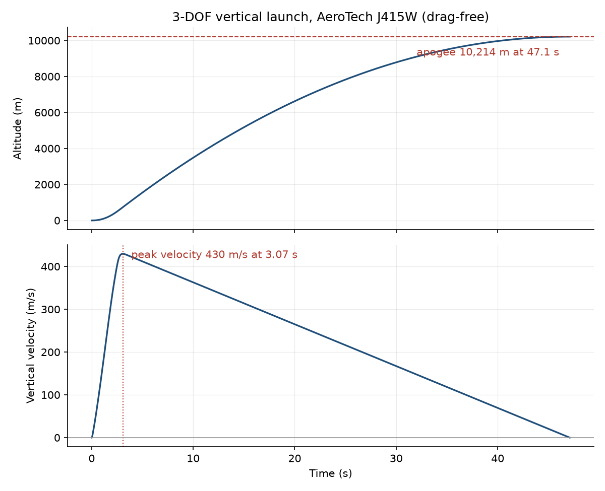

# rocket-sim

A 3-DOF flight simulator for high-power rockets, written in C++17.

The goal of this project is not to simulate a rocket — plenty of tools do that.
It is to build one whose correctness can be *demonstrated*. Every physical model
in it is checked against something external: an analytical solution, published
reference tables, or manufacturer test-stand data.

**Status:** the point-mass flight pipeline is implemented and validated. Drag,
attitude dynamics, and control are designed but not built. See
[Roadmap](#roadmap).



*Vertical launch on an AeroTech J415W. This is a **drag-free** trajectory with a
**2 kg placeholder** airframe mass, so the 10.2 km apogee is an upper bound, not
a prediction — a real vehicle on this motor would fall well short. Drag is the
next model to land.*

## What it models today

| Model | Implementation |
|---|---|
| Integration | Generic 4th-order Runge-Kutta, templated over any state type supporting `+` and scalar `*` |
| Propulsion | RASP `.eng` thrust curves, linearly interpolated |
| Mass | Impulse-proportional propellant depletion, not linear-in-time |
| Gravity | Inverse-square with altitude |
| Atmosphere | US Standard Atmosphere 1976, 7 layers to 71 km, with geopotential correction |
| Flight | Vertical launch integrated to apogee, 1-D motion carried in a 6-element 3-D state vector |

## What it does not model yet

Stated explicitly, because a simulator's limitations matter as much as its
features:

- **No aerodynamic drag.** Reported apogees are drag-free upper bounds.
- **No attitude dynamics.** The state vector has translation only; the vehicle
  has no orientation.
- **No control.**
- **No descent.** Integration stops at apogee.
- **No airframe model.** Vehicle mass is a hard-coded 2.0 kg placeholder.
- **No wind, Mach, or speed of sound.**

## Validation

Three claims, each backed by a test you can run.

**The integrator is really 4th order.** Writing RK4 and accidentally
implementing RK2 is a silent, plausible-looking failure. `tests/rk4_tests.cpp`
integrates a harmonic oscillator for 1000 steps and matches the analytical
`cos(t)` / `-sin(t)` solution within 1e-5. It then halves the timestep and
asserts the global error falls by a factor between 12 and 20 — theory says 2⁴ =
16. An accidental RK2 (~4×) or Euler (~2×) fails this test.

**The atmosphere matches published tables.** `tests/environment_tests.cpp`
checks density at 0, 5, 11, 15, 20 and 30 km against US Standard Atmosphere 1976
reference values, to within 1e-3 kg/m³, including the geometric-to-geopotential
altitude conversion that the standard is defined in. Sea-level gravity matches
9.80665 m/s² to 1e-5.

**The motor curve parses and interpolates exactly.**
`tests/motor_tests.cpp` covers the 27-point AeroTech J415W curve: total impulse
1290.54 N·s, burnout at 3.358 s, dry mass 0.47084 kg, interpolated thrust exact
to 1e-6 against hand-computed values, plus behaviour before ignition, at exact
burnout, and long after.

One more check comes free from the plot above: during coast the vehicle sheds
429.6 m/s over 44.0 s, a mean deceleration of 9.76 m/s². With thrust at zero and
no drag the only force left is gravity, which is 9.807 m/s² at sea level and
weakens with altitude — so that is the number it has to be, and it is.

**11 tests, 3 suites, all passing in 0.12 s.**

## Build

No manual dependency installation. Eigen 3.4.0 and GoogleTest 1.14.0 are both
fetched and pinned by git tag via CMake's `FetchContent`. You need CMake 3.16+
and a C++17 compiler.

```sh
cmake -B build -S .
cmake --build build --config Debug
```

## Run

The motor file is loaded by a path relative to the working directory, so run
from the repository root:

```sh
./build/Debug/3_dof_sim.exe flight.csv   # Windows / MSVC
./build/3_dof_sim flight.csv             # Linux / macOS
```

This writes `t_s,altitude_m,velocity_ms` to `flight.csv` and prints the apogee
to stderr. To regenerate the figure above:

```sh
python scripts/plot.py flight.csv -o docs/img/flight.png
```

The plotting script needs matplotlib. The simulator itself does not — it has no
Python dependency, by design.

## Test

```sh
ctest --test-dir build -C Debug --output-on-failure
```

## Repository layout

```
include/            headers, one directory per subsystem
  math/             rk4_integrator.hpp   header-only, templated
  vehicle/          motor.hpp
  dynamics/         environment.hpp
src/
  sim/              3_dof_sim.cpp        the flight driver
  vehicle/          motor.cpp
  dynamics/         environment.cpp
tests/              one GoogleTest file per subsystem
config/             motor data (RASP .eng)
scripts/            plot.py
docs/img/           figures used by this README
```

## Roadmap

Planned, in order. **None of the following is implemented yet.**

1. Validate apogee against the closed-form drag-free solution.
2. Aerodynamic drag, verified by switching it off and recovering step 1 exactly.
3. Quaternion attitude and full 6-DOF rigid-body dynamics.
4. Aerodynamic moments and passive stability.
5. PID attitude control, verified by disabling it and reproducing open-loop flight.
6. Monte Carlo dispersion analysis.

## References

- Thrust curve data: [ThrustCurve.org](https://www.thrustcurve.org), converted
  from Tripoli TMT test-stand data (1998).
- *U.S. Standard Atmosphere, 1976*, NOAA/NASA/USAF.
- [Eigen](https://eigen.tuxfamily.org) for linear algebra,
  [GoogleTest](https://github.com/google/googletest) for testing.

## License

MIT. See [LICENSE](LICENSE).
